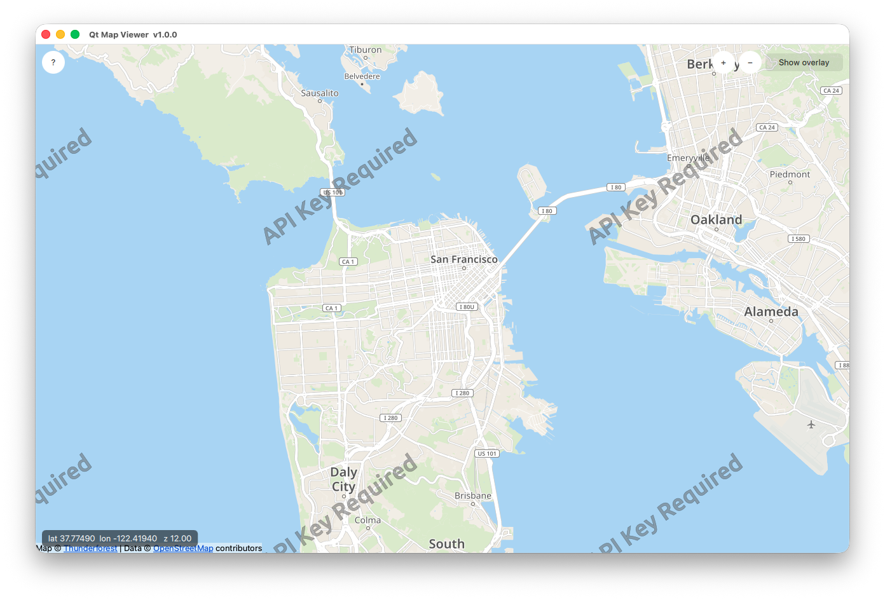
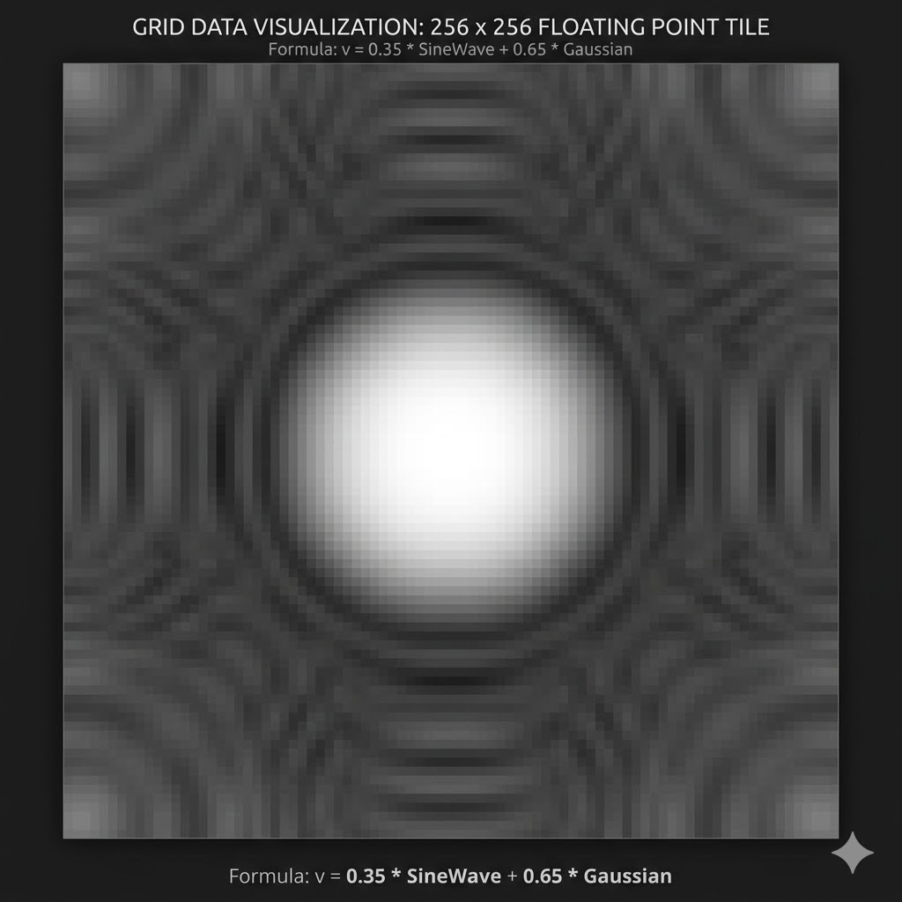
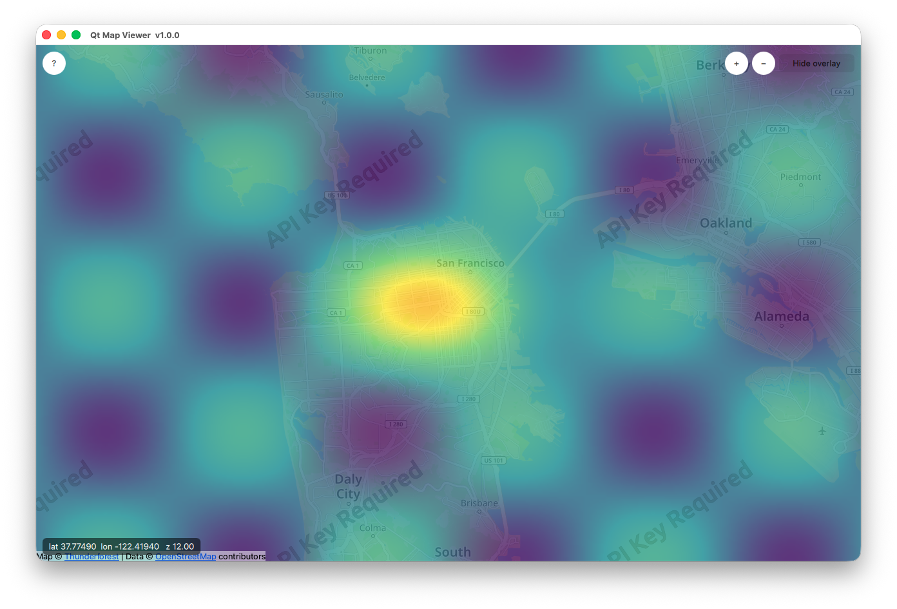

# qt-map1

Interactive map viewer built with **Qt 6** and **Qt Location**.
Displays OpenStreetMap tiles with pan, zoom, and an optional floating-point grid overlay rendered via an OpenGL/RHI fragment shader.

**GitHub:** https://github.com/landenlabs/qt-map1

---

## Features

- **OpenStreetMap tiles** — live tile streaming via the Qt Location OSM plugin
- **Pan & zoom** — mouse drag to pan, scroll-wheel or trackpad pinch to zoom, ± toolbar buttons
- **Float-grid overlay** — custom `QSGMaterialShader` renders a per-tile floating-point data grid through a viridis colormap GLSL fragment shader
- **Coordinate HUD** — live latitude / longitude / zoom display
- **About dialog** — version, build date, and source link

## Screenshots



Test Grid as a grey scale image



Test Grid rendered over map for every tile



## Requirements

| Dependency | Version |
|---|---|
| Qt | 6.5 or later (tested on 6.11) |
| CMake | 3.16 or later |
| C++ | 17 or later |
| Qt modules | Core, Gui, Quick, QuickControls2, Location, Positioning, OpenGL, Network, ShaderTools |

On macOS with Homebrew:
```
brew install qt
```

## Build

```bash
git clone https://github.com/landenlabs/qt-map1.git
cd qt-map1
mkdir build && cd build
cmake .. -DCMAKE_PREFIX_PATH=/opt/homebrew   # macOS/Homebrew
cmake --build . -j$(nproc)
./qt-map1
```

## Usage

| Action | Gesture |
|---|---|
| Pan | Click and drag |
| Zoom in / out | Scroll wheel, trackpad pinch, or ± buttons |
| Toggle overlay | "Show overlay" button (top-right toolbar) |
| About | "?" button (top-left) |

## Architecture

```
main.cpp                  — app entry point; exposes version/build-date to QML
main.qml                  — UI: Map, overlay, HUD, toolbar, about dialog
OverlayItem.h/.cpp        — QQuickItem subclass; drawTile(z,x,y) → QSGGeometryNode
FloatGridMaterial.h/.cpp  — QSGMaterial + QSGMaterialShader; UBO + texture upload
shaders/floatgrid.vert    — GLSL vertex shader (compiled to .qsb via qsb BATCHABLE)
shaders/floatgrid.frag    — GLSL fragment shader; viridis colormap
```

### Float-grid overlay

`OverlayItem::drawTile(z, x, y)` accepts Web-Mercator tile coordinates.
Currently it renders a static sine/cosine + Gaussian test grid so the shader pipeline can be verified without a live endpoint.

To connect a real data source set the `endpoint` property to a URL template and implement the phase-2 network fetch in `OverlayItem.cpp`:

```qml
OverlayItem {
    anchors.fill: map
    mapItem: map
    endpoint: "https://your-server/tiles/{z}/{x}/{y}.bin"
    dataMin: -10.0
    dataMax:  40.0
    opacity: 0.75
}
```

The fragment shader normalises raw float values from `[dataMin, dataMax]` to `[0, 1]` and maps them through a five-stop viridis colormap.

## License

MIT License — see [LICENSE](LICENSE) for details.

## Author

Dennis Lang — https://github.com/landenlabs
